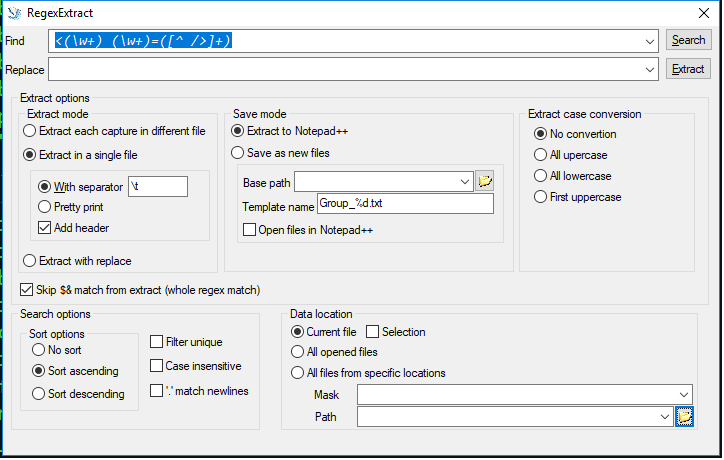

RegexExtract is a Notepad++ plugin that allows to extract text using regular expressions from Notepad++ opened files or files on storage.
Searching and extracting is done through plugin modal dialog.

Plugin dialog in Win32++


**How to build**

Clone repo:
```
$ git clone https://github.com/MojaveWastelander/NPPRegexExtract.git
$ cd NPPRegexExtract
```

Switch to old_version branch
```
$ git checkout old_version
```

Update submodules
```
$ git submodule update --init --recursive
```

Update Visual Studio project
```
$ cd msvc\common\npp
$ update_npp_proj.bat
```

**Prepare dependencies**

Install and integrate vcpkg as described [here](https://github.com/Microsoft/vcpkg)

Install following packages: boost-format, boost-property-tree, boost-regex, fmt, catch2. 

E.g. for x64 static build an install will look like this
```
$ vcpkg install boost-regex --triplet x64-windows-static
```

Open the solution from `msvc/RegexExtract/RegexExtract.sln` and build `RegexExtract`

When building `RegexExtract` it will first build Notepad++ project, then scintilla dlls (if they are missin in bin folder) then the plugin itself.
